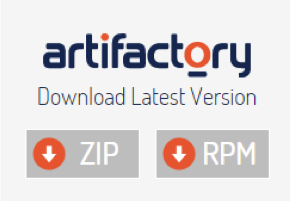

#Maven + Jenkins + Artifactory Integration

Big changes are made in our company right now: Sinch part is being separated from Rebtel. This means that not only application code should be separated, but also test framework. Of course split changes affect many team members which makes it harder to maintain different test framework parts. 

Previously only one dependency was used and it was not a big overhead to keep it as an exported JAR placed right in the project folder. The big split made it obvious that we need any remote server acting as an artifacts storage to get better transparency in code changes and version control. 

Recently we decided to pass to Artifactory.


First thing to start with is downloading and installing Artifactory from it’s [official site](http://www.jfrog.com/open-source/).

In our case we use Windows server virtual machine as a base for Artifactory service to run. To install Artifactory all you need to do is just browse to unzip the downloaded archive, go to  `%ARTIFACTORY_HOME%\bin` and execute the file `artifactory.bat`. This script searches for the Java executable and runs Artifactory's main class. After installing Artifactory you need to start it’s service either via Windows Services menu or using Command Prompt `(sc start|stop Artifactory)`.


After that Artifactory should be happily available on `http://SERVER_DOMAIN:8081/artifactory`.


First step’s done! Further we need to get it integrated into CI server, in our case it is Jenkins. There is available pretty simple and user-friendly plugin for this purpose. Surprisingly it is called [Artifactory plugin](https://wiki.jenkins-ci.org/display/JENKINS/Artifactory+Plugin). After installing it you can find in Jenkins settings ‘Artifactory’ section where it is required to specify Artifactory URL and user credentials who is granted deployer rights.


Now we have a pipeline which can publish artifacts to the remote Artifactory server. Next step is configuring a job which will build our target project and push compiled JAR to artifactory. Create a new job, in it’s settings page find Build section and specify path to POM file. Also it is required to add Maven goals to get your project files built. In our case we also would like to synchronize Jenkins build version with deployed artifact’s version. This is made via passing Jenkins BUILD_NUMBER variable to Maven. 


In Post-build actions section add Deploy artifacts to Artifactory step and specify there exactly you would like to add your artifacts and check ‘Deploy maven artifacts’ checkbox.


And, of course, you need to specify project name and path to your repository.


As a final step it is required to modify target project’s POM file. Make sure you have maven-compiler-plugin and maven-jar-plugin in ‘plugins’ section.

````
<plugins>
     <plugin>
        <artifactId>maven-compiler-plugin</artifactId>
        <version>3.1</version>
        <configuration>
          <source>1.6</source>
          <target>1.6</target>
        </configuration>
     </plugin>
     <plugin>
        <groupId>org.apache.maven.plugins</groupId>
        <artifactId>maven-jar-plugin</artifactId>
        <version>2.5</version>
        <configuration>
          <archive>
             <index>true</index>
             <manifest>
                <addClasspath>true</addClasspath>
             </manifest>
             <manifestEntries>
                <Implementation-Version>${build.number}</Implementation-Version>
             </manifestEntries>
          </archive>
        </configuration>
     </plugin>
</plugins>
````

Also important to add groupId, artifactId, verison and packaging to the top-level element of the POM. Please note that we are using `${build.number}` property which we are getting from Jenkins as a parameter when the project is built.

````
<groupId>CommonKeywords</groupId>
<artifactId>CommonKeywords</artifactId>
<version>0.0.1-SNAPSHOT-${build.number}</version>
<packaging>jar</packaging>
```

Bingo! Everything is set up to publish compiled JAR file to remote server. All you need to do is save all your changes, push it to remote repository and press  ‘Start building’ button in your Jenkins job which is connected to Artifactory. After the job has finalized all its steps in ‘Build history’ section you can notice a link to Artifactory where all the produced artifacts are stored.


From now on it is possible to use published artifacts in other projects as a maven dependency. All you need to set this up is to add a dependency with groupId, artifactId you specified in previous steps. Version of the added dependency you cpecify based on version number which is deployed to Artifactory, e.g.:

````
<dependency>
        <groupId>CommonKeywords</groupId>
        <artifactId>CommonKeywords</artifactId>
        <version>0.0.1-SNAPSHOT-54</version>
</dependency>
```

Basically Maven searces all its dependencies in central Maven repository first. But we don’t pushed our project there and that’s why we have to point Maven to our private Artifactory server. You can go to Artifactory and under ‘Artifacts’ in ‘Tree browser’ it’s easy to find releases or snapshots repository (we specified it in one of previous steps in job settings). On this page there is  ‘Distribution management’ section which is exactly you need to add to your POM to get proper conneciton to Artifactory. Also, if you want to enable snapshots in addition to release versions please add appropriate property to your ‘repository’ section in the POM. Other option is to separately define snapsot and release repository.

````
<repositories>
  <repository>
     <id>CLAESTOR</id>
     <name>CLAESTOR-snapshots</name>
     <snapshots>
                <enabled>true</enabled>
     </snapshots>
     <url>http://your_ip_address:8081/artifactory/snapshots</url>
  </repository>
</repositories>
```

That’s it!

Following scheme shows how the combination of Maven, Jenkins and Artifactory works in Split team to maintain shared test automation framework components. 

 


Common workflow working with Artifactory is as follows:

1.  Changes in target project are pushed to Git repository.
2. Jenkins gets latest code from Jit and triggers a Job.
3. Jenkins job uses Maven goals to package a Jar (clean install) and to assign a proper version to the Jar `(-Dbuild.number=${BUILD_NUMBER})`.
4. Jar file gets pushed to Artifactory by Jenkins job (as post-build action). Now the artifact is ready to be downloaded and used as a Maven dependency.
5. Maven dependency (Pom file) in projects which are using target project are updated to the latest version available from Artifactory.
6. Maven downloads dependency from Artifactory and stores it on a local machine `(../.m/repositories)`.


